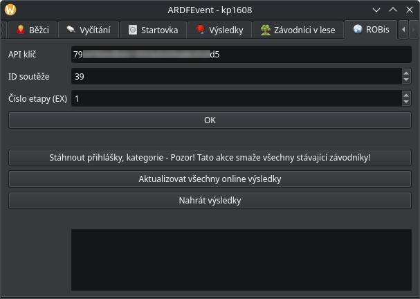
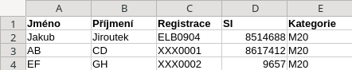

Tutoriál
########

.. sectionauthor:: Jakub Jiroutek <jiroutekja@seznam.cz>

Tady najdete přesný průvodce organizací okresního přeboru v JJ ARDFEventu.

Založení závodu
***************

Po spuštění JJ ARDFEventu se vám zobrazí takovéto okno:

v něm vyberte :code:`Nový závod` a v :term:`dialogu<dialog>` zadejte ID závodu **bez mezer a zvláštních znaků (jmenuje se tak soubor)** - např. :code:`kp1608`.

Vyskočí vám hlavní okno:

.. image:: _static/tutorial/2.png
  :height: 300

Nastavení závodu s ROBisem
**************************

V kartě :code:`Základní info` nemusíte vyplňovat nic, přejděte rovnou do záložky :code:`ROBis`.

.. caution:: Před stahováním si ověřte, že je vše co se stahuje (název závodu, pásmo, limit, pořadatel a čas statu 00 nastavený u etapy v ROBisu), jinak se to JJ ARDFEventu nebude líbit a bude házet errory

V okně :code:`ROBis` vyplňte všechny požadované údaje a uložte je tlačítkem :code:`OK`.

.. hint::

  **Jak najít požadované údaje v ROBisu**

  - API klíč: najdete u příslušné etapy
  - ID soutěže: (z URL v prohlížeči při otevřeném závodě) :code:`https://rob-is.cz/soutez/39/?race=484&tab=results` => ID soutěže je **39** (484 je ID etapy, JJ ARDFEvent toto číslo nezajímá)
  - Číslo etapy: E2 => číslo etapy je **2**

Pro stažení nastavení závodu, přihlášek a kategorií klikněte na :code:`Stáhnout přihlášky, kategorie`.

.. attention:: Import z ROBisu samozřejmě funguje jen tehdy, když jste připojeni k interetu. Když je připojení pomalé, JJ ARDFEvent na chvíli zamrzne.

V dolním :term:`logu<log>` se zobrazí, které kategorie byly vytvořeny a :code:`Import OK`:

.. image:: _static/tutorial/5.png
  :height: 300

S uložením API klíče se automaticky budou nahrávat živé výsledky na ROBis při vyčítání.

Nastavení závodu bez ROBisu
***************************

Pokud závod nezadáváte do ROBisu, můžete si ho nastavit ručně.
V kartě :code:`Základní info` vyplňte všechny údaje a uložte je tlačítkem :code:`OK`.

Jak přidat kategorie se dozvíte v :ref:`Manuální přidání kategorií`.

CSV import přihlášek
====================

CSV import proběhne po vybrání souboru v kartě :code:`Import`.

Příklad souboru pro import:

.. caution:: Z Excelu/LO exportujte jako CSV s rozdělovníkem :code:`;`.

Zde příklad :term:`logu<log>` po naimportování souboru výše:

.. image:: _static/tutorial/8.png
  :height: 300

.. note:: Klub XXX není v AROB ČR validní, tudíž hází upozornění.

Nastavení kontrol
*****************

Kontroly se nastavují v kartě :code:`Kontroly`:

Buď můžete kontroly přidat ručně kliknutím na :code:`Přidat`, nebo zvolit přednastavené sady kontrol.

.. caution:: Nezapomeňte kliknout vždy před odchodem z karty na :code:`Uložit`!

Vlastnosti kontrol
==================

Jméno kontroly
--------------

Kontrola může mít jákekoliv alfanumerické jméno, pro přehlednost vyčítacího lístku doporučuji
ale maximálně 4 znaky (např. :code:`1`, :code:`R2`, :code:`5F`, :code:`4/R4`, :code:`M` nebo :code:`S`)

SI kód
------

Jakékoliv číslo v :math:`\langle31; 255\rangle`, samozřejmě stejné číslo jako nastavujete v :code:`SI Config+`

Příznaky kontroly
-----------------

Kontrola může být nastavena jako (vzájemně se nevylučují):

- :code:`Povinná` - musí být vyčtena, jinak je závodník diskvalifikován
- :code:`Divácká` - kontrola odděluje okruhy - např. pomalé a rychlé

.. hint:: :code:`S` nastavujte jako povinnou, příznak :code:`Divácká` je zatím nefunkční a nic nemění

Spojování kontrol
-----------------

**V případě, že má více kontrol jednu SI jednotku, je nemožné aby existovaly obě dvě v JJ ARDFEventu**.
Jednoduše vytvořte jednu kontrolu a pojmenujte ji např. :code:`5/R5`. Jak to udělat tak, aby nebylo spojení vidět i na startovce najdete v sekci :ref:`Kategorie + tratě`

Přednastavené sady kontrol
==========================

Sady jsou:

- :code:`Pomalé kontroly`: 1, 2, 3, 4, 5, M - povinná
- :code:`Všechny kontroly`: 1, 2, 3, 4, 5, R1, R2, R3, R4, R5, M - povinná
- :code:`Všechny kontroly`: 1, 2, 3, 4, 5, S - povinná + divácká, R1, R2, R3, R4, R5, M - povinná

Kategorie + tratě
*****************

Kategorie a tratě se nastavují v kartě :code:`Kategorie`.
Jestliže jste stahovali závod z ROBisu, kategorie budou již naimportované.

.. image:: _static/tutorial/10.png
  :height: 300

Manuální přidání kategorií
==========================

Novou kategorii vytvoříte tím, že do :term:`dialogu<dialog>` po kliknutí na :code:`Nová kategorie` zadáte název:

.. image:: _static/tutorial/6.png
  :height: 300

Definování tratě
================

Kontroly (v levém sloupečku) do tratě (v pravém sloupečku) přidáváte dvojklikem v pořadí, v jakém je chcete zobrazovat na výsledcích.
V případě překliku nebo změny tratí se kontrola odebírá dvojklikem v pravém sloupečku.

Kontroly zobrazované před závodem
=================================

Jestliže máte spojené kontroly (např. :code:`4/R4`, viz :ref:`Spojování kontrol`), jako na obrázku výše,
nechcete aby závodníci ze startovky poznali, že je kontrola spojená. Kontroly zobrazované ve startovce
se dají nastavit v poli :code:`Před závodem zobrazované kontroly` v kartě :code:`Kategorie` (pole se
samo nastavuje při přidání kontroly). Ve výše uvedeném případě by jste :code:`1, 2, 4/R4, M` přepsali na
:code:`1, 2, 4, M` a závodníci by tak nepoznali, že je kontrola spojená. Toto musíte provést u každé kategorie.

Startovka
*********

Startovku spravujete v kartě :code:`Startovka`.
Nachází se tam řaditelná tabulka (např. kliknutím na nadpis sloupce :code:`Kategorie`, seřadíte podle kategorie, funguje pro všechny sloupce)

.. tip:: Jestli chcete startovat na krabičku, startovku nelosujte.

.. warning:: Když je vylosovaná startovka a závodník má čas startu v čipu, počítá se čas z čipu.

Losování startovky
==================

Slovníček cizích pojmů
**********************
.. glossary::

  dialog
    vyskakovací okno

  log
    záznam událostí, které se dějí v programu